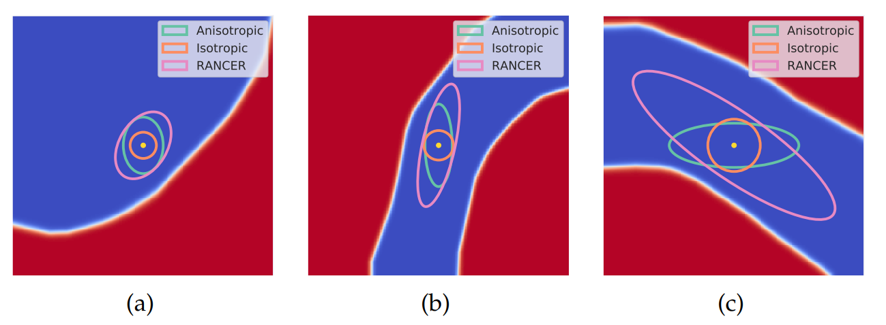

## Bachelor Thesis:
# Non-Axis Aligned Anisotropic Certification with Randomized Smoothing

### Author: Taras Rumezhak
### Supervisor: Adel Bibi

Example of the l2 certificates regions presented on the
2D toy dataset, where the blue and red regions correspond to differ-
ent data classes. Orange: Data dependent isotropic region, Blue:
Anisotropic (ANCER) region, Pink: Certification region obtained
with our proposed solution - RANCER 

  
